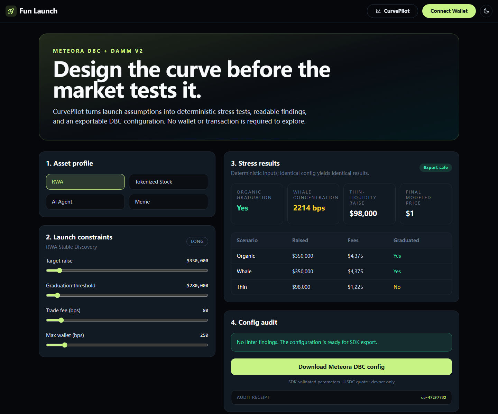

# Meteora CurvePilot

AI-native launch design lab for Meteora Dynamic Bonding Curve (DBC) and DAMM v2.

CurvePilot helps builders choose, simulate, audit, and export launch configurations before they risk capital. It focuses on four asset classes highlighted by the Crypto World's Fair x Meteora track: RWAs, tokenized stocks, AI-agent assets, and memes.



## What works

- Four editable launch presets with deterministic stress scenarios.
- Config linter for allocation, fees, graduation, wallet concentration, and DAMM v2 compatibility.
- Official `@meteora-ag/dynamic-bonding-curve-sdk` adapter and SDK validation for every shipped preset.
- Downloadable `buildCurve` parameter files for a USDC-quoted devnet workflow.
- A guarded relay that rejects non-devnet configuration and simulates before broadcasting.
- Seven core tests plus a production Next.js build.

## Workflow

1. Select an asset profile.
2. Tune raise, graduation, fee, and wallet constraints.
3. Compare organic, whale, and thin-liquidity stress results.
4. Resolve blocking config findings.
5. Download SDK-validated Meteora DBC parameters.
6. Review and use the parameters on Solana devnet only.

## Judging alignment

- **Meteora integration:** official DBC SDK `buildCurve` input plus DAMM v2 migration configuration.
- **Technical execution:** typed schema, deterministic simulation, SDK validation, tests, and a production build.
- **Originality:** safety-first launch tooling rather than another single-purpose meme launchpad.
- **Impact:** reusable developer tooling across RWAs, tokenized stocks, AI-agent assets, and memes.

## Run locally

```bash
npm install
npm test
npm run dev
```

Open [http://localhost:3000/curvepilot](http://localhost:3000/curvepilot).

## Safety

No custody, private-key storage, automatic mainnet deployment, or CI transactions. Wallet auto-connect is disabled. The optional transaction relay only runs when `SOLANA_CLUSTER=devnet` and the HTTPS RPC hostname explicitly contains `devnet`; it simulates every transaction before broadcast.

## Upstream

The UI starts from Meteora Invent's ISC-licensed `fun-launch` scaffold.

- https://docs.meteora.ag/developer-guides/dbc
- https://docs.meteora.ag/developer-guides/damm-v2
- https://github.com/MeteoraAg/meteora-invent
- https://github.com/MeteoraAg/dynamic-bonding-curve-sdk
